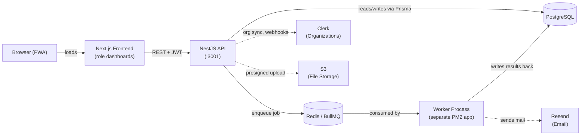
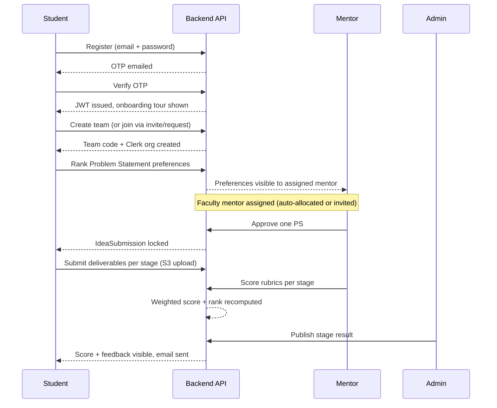
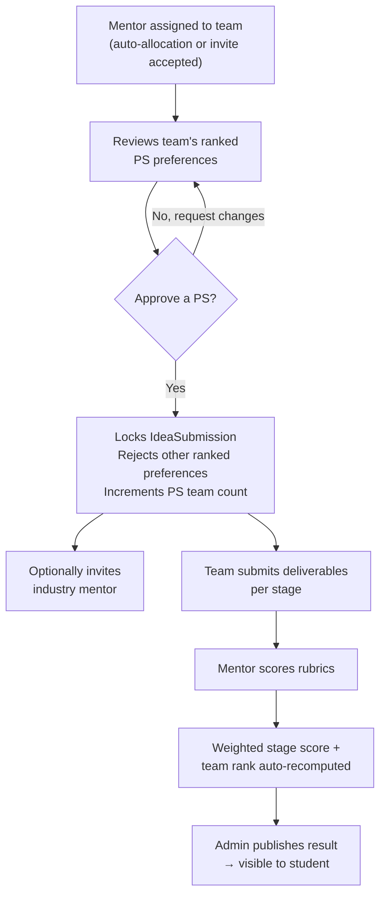
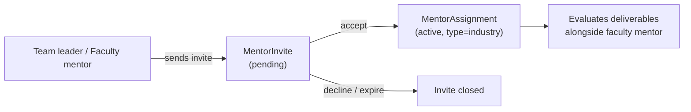
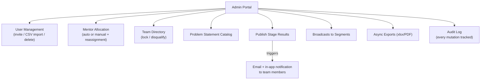
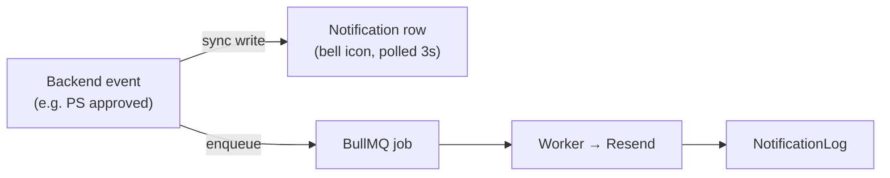
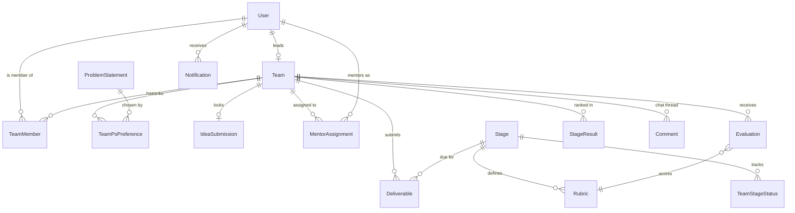

# Prabodh — Portal Workflows & System Architecture

This document explains how the Prabodh SIH Project-Based Learning portal works: the overall architecture, every role-based portal, and the end-to-end workflows connecting them. Use it as a reference for explaining the system to others or as source material for diagrams/presentations.

---

## 1. System Overview

Prabodh is **one Next.js frontend + one NestJS backend**, not separate apps per role. All five roles (student, institute mentor, industry mentor, student expert, admin) log into the same application and are routed to different dashboard sections based on their role.

| Layer | Technology |
|---|---|
| Frontend | Next.js 16 (App Router), React 19, TypeScript, Tailwind CSS |
| Backend | NestJS 10, TypeScript, REST API |
| Database | PostgreSQL via Prisma ORM |
| Auth | Custom email/password + OTP, self-issued JWTs (Clerk used only for org-based team invites) |
| Background jobs | BullMQ + Redis, run by a separate worker process |
| Email | Resend (unified "Prabodh" branded template) |
| File storage | S3-compatible object storage (presigned uploads) |
| Hosting | Self-hosted VM, PM2 process manager, nginx, deployed via GitHub Actions |
| Real-time | None — near-real-time via 3-second client-side polling (no websockets) |

### Architecture Diagram

---

## 2. Roles & Dashboards

| Role (`PlatformRole`) | Dashboard route | Self-register? | Primary responsibility |
|---|---|---|---|
| `student` | `/dashboard/student` | Yes (email + OTP) | Form/join team, rank problem statements, submit deliverables |
| `institute_mentor` | `/dashboard/mentor` | No — admin-created | Approve problem statement, evaluate stages, answer queries |
| `industry_mentor` | `/dashboard/industry` | No — admin-created | Secondary mentorship, evaluation, invite-based team attach |
| `student_expert` | `/dashboard/expert` | No — admin-created | Peer-level support role |
| `admin` | `/dashboard/admin` | No — seeded | User import, mentor allocation, publish results, audit log, exports |

Faculty and industry mentor accounts **cannot self-register** — admins create them via CSV bulk import or single invite, and credentials are emailed directly.

---

## 3. Student Portal

### What it does
- Register with email + password → verify via **OTP emailed to them** → JWT issued → lands on dashboard with a guided onboarding tour (first-time only).
- Create a team (becomes leader, gets a unique team code + auto-created Clerk org) **or** join an existing team via invite / join-request.
- Invite teammates by email (Clerk org invite + email + in-app notification).
- Rank Problem Statement (PS) preferences, or propose a custom idea.
- Track mentor assignment status.
- Submit deliverables per project stage (PPT, report, video, GitHub link) via presigned S3 upload.
- View published stage results/scores once admin releases them.
- Chat with mentor via team comments thread (near-real-time, 3s polling).

### Student Journey Diagram

---

## 4. Institute (Faculty) Mentor Portal

### What it does
- Account created by admin (no self-registration).
- Gets assigned to teams either automatically (least-loaded + theme-matching algorithm) or by accepting a team's invite.
- Reviews a team's ranked PS preferences and **approves one**, which locks the team's `IdeaSubmission` and rejects the other ranked choices.
- Manages industry-mentor invitations for their teams (subject to a configurable cap).
- Scores rubric-based evaluations per stage; every submission is versioned (superseded, never overwritten) and automatically recomputes the team's weighted score and rank.
- Answers team queries via the team comments/chat thread.
- Can view/manage all teams currently assigned to them.

### Mentor Decision Flow

---

## 5. Industry Mentor Portal

### What it does
- Account created by admin.
- Attached to a team via an **invite-accept flow only** — never auto-assigned (initiated by the faculty mentor or team leader).
- Provides secondary evaluation/scoring alongside the institute mentor.
- Cap on number of industry mentors per team is a configurable platform setting.
- Has its own profile fields: company, designation, domain expertise.

---

## 6. Admin Portal

### What it does
- **User management**: single invite or bulk CSV import (staged for review → activate/reject), credential emails, hard user deletion with preview/confirm.
- **Mentor allocation**: manual assignment or trigger the auto-allocation algorithm (least-loaded + theme match); reassignment with full audit trail.
- **Teams**: directory with filters, lock/freeze a team, disqualify a team.
- **Problem statements**: manage the SIH PS catalog (seeded from CSV).
- **Evaluations/results**: explicitly **publish** stage results, which is the gate that makes scores visible to students and triggers notification emails.
- **Broadcasts**: send announcement-style messages to filtered user segments.
- **Analytics/exports**: dashboard KPIs, funnel view, async xlsx/PDF exports via the job queue.
- **Audit log**: every mutating action (team change, mentor change, evaluation, disqualify) is recorded with before/after snapshots.
- **Platform settings**: key/value config — member caps, industry mentor caps, invite TTLs, draft hold hours.

---

## 7. Notifications — Dual-Channel Pattern

Every meaningful event (invite, approval, deadline, published grade) writes to **two places at once**:

- The in-app write is **synchronous** — instant.
- The email is **asynchronous** through the queue — if Resend is slow, the original request still returns immediately.
- All emails render through one shared branded HTML template covering: team invite, mentor allocation, staff credentials, deadline reminder, evaluation published, admin broadcast, status change, PS review, join request (+ outcome), OTP.

---

## 8. Background Jobs (Worker Process)

Runs as a separate PM2 process, consuming four BullMQ queues:

| Queue | Purpose |
|---|---|
| `notifications` | Sends queued transactional emails |
| `exports` | Generates admin xlsx/PDF exports asynchronously |
| `reminders` | Repeating job (every 15 min): deadline reminders at 48h/4h before stage deadlines, auto-locks deliverables past deadline, expires stale invites, cleans up stale draft ideas |
| `aggregations` | Recomputes team/stage results after an evaluation is submitted |

---

## 9. Data Model Summary

Core Prisma entities and how they relate:

---

## 10. End-to-End Summary (one paragraph per portal)

- **Student**: registers → verifies OTP → forms/joins a team → ranks problem statements → waits for mentor approval → submits deliverables per stage → sees published scores.
- **Institute mentor**: receives team assignment → approves a problem statement → oversees industry mentor invites → scores rubrics per stage → resolves team queries via chat.
- **Industry mentor**: accepts an invite from a team/faculty mentor → scores deliverables alongside the institute mentor.
- **Admin**: onboards all mentor/faculty accounts → allocates mentors → manages the PS catalog → publishes results → monitors everything via audit logs and exports.

---

*Generated from the Prabodh codebase: `backend/prisma/schema.prisma`, `backend/src/modules/*`, `frontend/app/dashboard/*`.*
